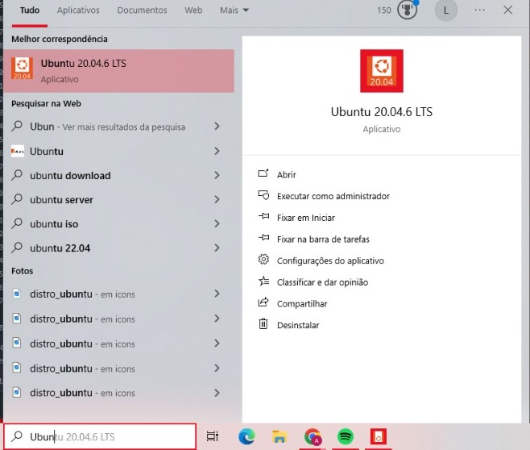

# NginxServer
Colocando um servidor Nginx no ar, utilizando a WSL2 e Ubuntu 20.04 no Windows Subsystem for Linux e criação de script de status do serviço Nginx.

# DOCUMENTAÇÃO
Primeiramente iremos preparar o ambiente de trabalho, instalando as ferramentas necessárias.
- WSL2
- Ubuntu 20.04
- Windows 10
- Nginx

  # Step 1: Ativando o subsistema do windows para linux.
     - Abra o painel de controle no windows.
     
     - Vá em programas.
     - Clique em ativar e desativar recursos do windows.
     - Irá aparecer uma lista, procure "Subsistema do Windows para Linux".
     - Ative a opção.
     - Dê o OK e espere a instalação finalizar.
     - Reinicie seu dispositivo.
     - Se o seu já estiver ativado, continue seguindo os próximos passos*.
  # Step 2: Baixar o Ubuntu dentro da Windows Store.
     - Vá no menu Iniciar do Windows.
     - Acessa a Microsoft Store.
     - Digite no campo de busca "Linux".
     - Procure a versão mais atual do Ubuntu LTS(Long Term Support).
     - Prossiga e Instale.
     - Vá no menu iniciar e ele irá aparecer.
     - Clique nele.
     - Ao carregar ele irá pedir um nome de usuário.
     - E também pedirá uma senha. (*Tenha certeza de anotá-la em algum lugar seguro para não esquecê-la)
  # Step 3: Instalando o Nginx.
     - Antes de instalarmos qualquer coisa, iremos atualizar os pacotes.
     - Digite "sudo apt update && sudo apt upgrade".
     - Se ele fizer alguma pergunta digite "y" para confirmar a instalação dos pacotes.
     - Agora digite "sudo apt install nginx"
     - Se ele fizer alguma pergunta digite "y" para confirmar a instalação dos pacotes.
  # Step 4: Configurando o Firewall.
     - Antes de testar, precisamos ter certeza de que o firewall não irá tentar impedir a ativação do nginx.
     - Listando as configurações das aplicações: "sudo ufw app list"
       - Nginx Full ( Abre a porta 80 (tráfico web não criptografado) e 443 (TLS/SSL tráfico criptografado)
       - Nginx HTTP ( Abre apenas a porta 80)
       - Nginx HTTPS (Abre apenas a porta 443)
    - Por agora iremos ativar apenas o tráfico na porta 80, ou seja o Nginx HTTTP
    - Digite "sudo ufw allow 'Nginx HTTP'
    - Digite "sudo ufw disable" e em seguida "sudo ufw enable" para reiniciar o firewall.
    - Verfique o status: "sudo ufw status"
  # Step 5: Verificando o Nginx.
    - Podemos checar se ele está rodando com o comando "systemctl status nginx"
    - - Comandos usados no nginx:
      - sudo systemctl stop nginx (para o serviço)
      - sudo systemctl systemctl start nginx (inicia o serviço)
      - sudo systemctl restart nginx (reiniciar o serviço)
      - sudo systemctl reload nginx (recarregar  o serviço sem parar as conexões)
      - sudo systemctl disable nginx (desabilitar o serviço)
      - sudo systemctl enable nginx (habilitar o serviço)
  # Step 6: Criando o script de validação
  Iremos utilizar um shell script(irei chamá-lo de "status.sh"), com uma extensão .sh, esse script validará se o serviço está ativo ou não e enviaá o seu status para um diretório que iremos criar(irei chamá-lo de "StatusNginx").
  O status.sh conterá Data e hora, nome do serviço,  status, uma mensagem personalizada indicando seu status( online ou offline).
  O status.sh gerará dois arquivos de saída:
  - online.sh - arquivo de serviço online.
  - offline.sh - arquivo de serviço offline.
    
  Esse script será executado a cada 5 minutos, e a cada execução ele terá uma nova versão.(Ex: statusv1.sh)

